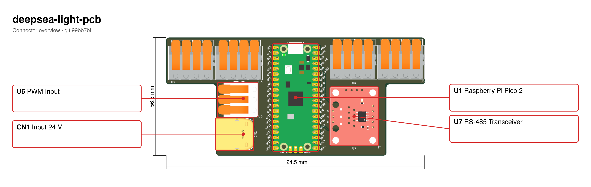

# deepsea-light-pcba
A PCB for controlling Deepsea Lights

## Connectors

Rendered automatically by [kicad-callouts](https://github.com/keenanjohnson/kicad-callouts) via GitHub Actions whenever the board changes.

## Random Notes

I usually use this project to get parts / footprints:

https://github.com/TousstNicolas/JLC2KiCad_lib

### Example usage

JLC2KiCadLib C3818565        -dir Deepsea_light_lib            \
                             -model_dir Deepsea_light_dir      \
                             -footprint_lib Deepsea_light_lib  \
                             -symbol_lib_dir Deepsea_light_dir \
                             -symbol_lib Deepsea_light_lib
